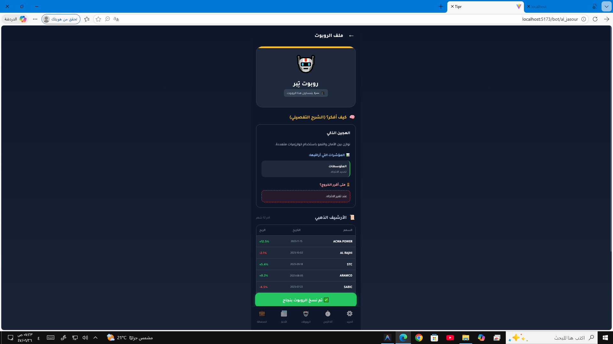

# 🥇 تِبْر - منصة التداول الذكي

## منصة تداول فاخرة مدعومة بالذكاء الاصطناعي للمستثمرين السعوديين

---

## 📋 نظرة عامة

**تِبْر** هي منصة PWA بنكية عالية الجودة مصممة للمستثمرين السعوديين من ذوي الملاءة المالية العالية (VIP).

### القيم الأساسية:
- 🏛️ **السلطة** - حضور مهني وموثوق
- 🤝 **الثقة** - عمليات شفافة واتصال واضح
- 👁️ **الشفافية** - سبب كل صفقة مرئي
- 💰 **حفظ الثروة** - نهج محافظ للمستثمرين التقليديين

---

## 🤖 الجبابرة العشرة (استراتيجيات الروبوتات)

| الرمز | الاسم | الاستراتيجية | منطق الشراء |
|-------|-------|--------------|-------------|
| 🥇 | **النامي** | النمو والاتجاه | السعر > متوسط 50 يوم + حجم > 150% |
| 🥈 | **القناص** | المضاربة الفنية | RSI < 30 مع ارتداد |
| 🥉 | **الجسور** | المخاطرة العالية | انخفاض 5% يومياً |
| ⚡ | **البرق** | الزخم السريع | طفرة حجم > 3 انحرافات |
| 👁️ | **البصيرة** | تحليل المعنويات | أخبار إيجابية > 70% |
| ⚖️ | **الرزين** | القيمة | مكرر الربح < 15 |
| 📈 | **الخبير** | التحليل الكلاسيكي | التقاطع الذهبي (SMA50 > SMA200) |
| ⚓ | **الراسي** | التوزيعات | عائد التوزيع > 4% |
| 💰 | **الذخيرة** | الادخار المنتظم | شراء أسبوعي ثابت |
| 🛡️ | **المدرع** | التحوط | عكس مؤشر تاسي |

---

## 🛠️ التقنيات المستخدمة

### الواجهة الأمامية (Frontend)
- **React** (Vite) - إطار العمل
- **Tailwind CSS** - التنسيق
- **Framer Motion** - الحركات
- **Recharts** - الرسوم البيانية

### الواجهة الخلفية (Backend)
- **Python** (FastAPI) - الخادم
- **yfinance** - بيانات الأسهم الحقيقية
- **ta** - المؤشرات الفنية
- **feedparser** - أخبار RSS

---

## 🚀 طريقة التشغيل

### 1️⃣ تشغيل الخادم الخلفي
```powershell
cd c:\Users\HP\Desktop\Apps\Tipr\backend
python -m uvicorn app.main:app --reload --host 0.0.0.0 --port 8000
```

### 2️⃣ تشغيل الواجهة الأمامية
```powershell
cd c:\Users\HP\Desktop\Apps\Tipr\frontend
npm run dev
```

### 3️⃣ فتح في المتصفح
- 🏠 **الرئيسية:** http://localhost:5173/
- 📺 **البث المباشر:** http://localhost:5173/live
- 🤖 **الروبوتات:** http://localhost:5173/bots
- 📰 **الراصد:** http://localhost:5173/news
- ⚙️ **الإعدادات:** http://localhost:5173/settings
- 📚 **توثيق API:** http://localhost:8000/docs

---

## 📱 صفحات التطبيق

### 🏠 الصفحة الرئيسية (Dashboard)
- مؤشر تاسي الحي
- مؤشر التفاؤل (Sentiment Meter)
- ترتيب أفضل الروبوتات
- أبرز التحركات (الرابحون/الخاسرون)

### 📺 البث المباشر (Live Broadcast)
- صفحة على طريقة TikTok
- ترتيب الروبوتات العشرة
- محاكاة الثروة (ماذا لو استثمرت؟)
- شريط أخبار الراصد

### 🤖 ملف الروبوت (Bot Profile)
- بطاقة الهوية
- منحنى النمو (Equity Curve)
- إحصائيات الأداء
- آخر الصفقات

### 📊 تفاصيل الصفقة (Trade Details)
- **الرسم البياني المُعلَّق** مع:
  - نقطة الدخول (خط أخضر)
  - الهدف +3% (خط ذهبي)
  - وقف الخسارة -1.5% (خط أحمر)
  - مؤشر RSI
  - متوسطات SMA
- **لماذا هذه الصفقة؟** - شرح منطق الدخول
- روابط التحقق الخارجية (تداول، TradingView، أرقام)

### 📰 الراصد (News Center)
- مؤشر التفاؤل العام
- الأخبار مع تحليل المعنويات
- خريطة الزخم الحرارية

### ⚙️ آلة الزمن (Time Machine)
- اختيار تاريخ البدء والنهاية
- تحديد رأس المال
- تشغيل المحاكاة على بيانات تاريخية حقيقية

---

## 🎨 التصميم

| العنصر | القيمة |
|--------|--------|
| **لون الخلفية** | كحلي داكن `#0f172a` |
| **اللون الرئيسي** | ذهبي `#fbbf24` |
| **خط العناوين** | Noto Kufi Arabic |
| **خط الأرقام** | Almarai |
| **الاتجاه** | RTL (من اليمين لليسار) |

---

## 📡 واجهة برمجة التطبيقات (API)

### نقاط النهاية الرئيسية:

| المسار | الوصف |
|--------|-------|
| `GET /api/market/tasi` | مؤشر تاسي |
| `GET /api/market/stocks` | جميع الأسهم |
| `GET /api/market/stock/{symbol}` | سهم محدد مع المؤشرات |
| `GET /api/bots` | الروبوتات العشرة |
| `GET /api/bots/{id}/performance` | أداء روبوت |
| `POST /api/backtest/run` | تشغيل المحاكاة |
| `GET /api/news` | الأخبار الحقيقية |
| `GET /api/news/sentiment` | تحليل المعنويات |

---

## ⚠️ ملاحظات مهمة

1. **البيانات حقيقية** - يتم جلبها من Yahoo Finance وأخبار RSS
2. **لا أرقام عشوائية** - كل شيء مبني على بيانات السوق الفعلية
3. **المحاكاة تاريخية** - تعتمد على أحداث السوق الحقيقية

---

## 📁 هيكل المشروع

```
Tipr/
├── 📁 frontend/              # React (Vite)
│   ├── public/
│   │   ├── manifest.json     # إعدادات PWA
│   │   └── sw.js             # Service Worker
│   └── src/
│       ├── components/       # المكونات
│       ├── pages/            # الصفحات
│       ├── services/         # API
│       └── styles/           # التنسيق
│
└── 📁 backend/               # Python (FastAPI)
    └── app/
        ├── main.py           # الخادم الرئيسي
        └── services/
            ├── market_engine.py    # بيانات السوق
            ├── backtest_engine.py  # آلة الزمن
            ├── news_scraper.py     # الأخبار
            └── alrased_logic.py    # الراصد
```

---

## 🏆 صُنع بـ ❤️ للمستثمرين السعوديين

**تِبْر** - الذهب الخام في عالم التداول الذكي
